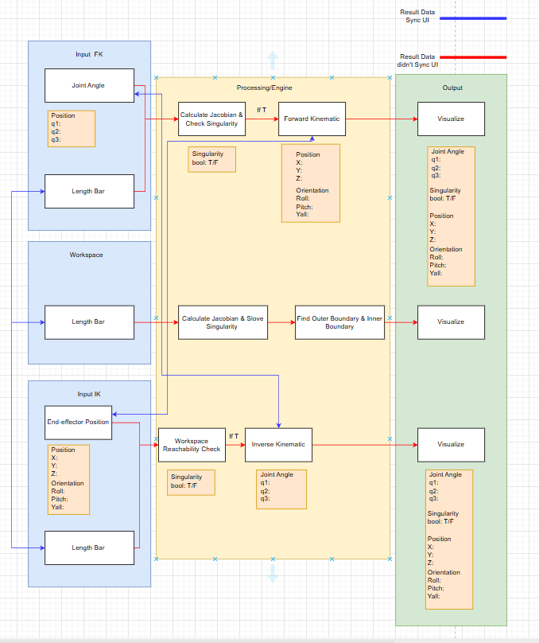
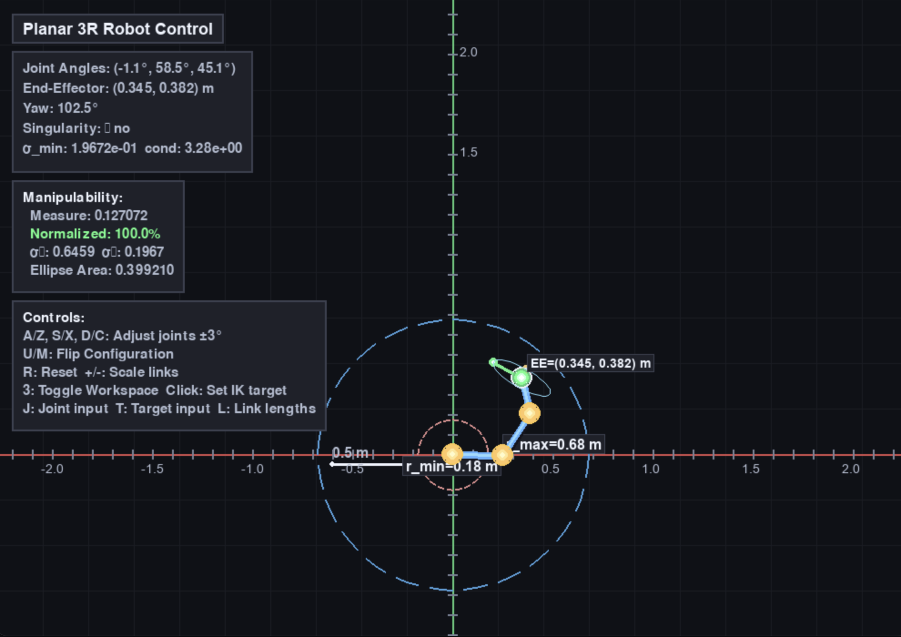
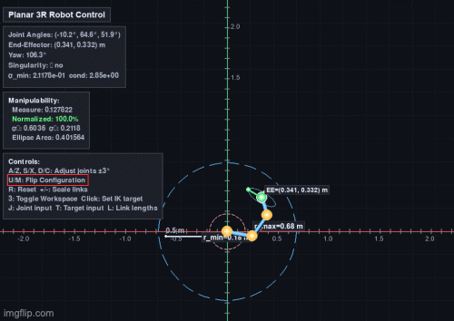
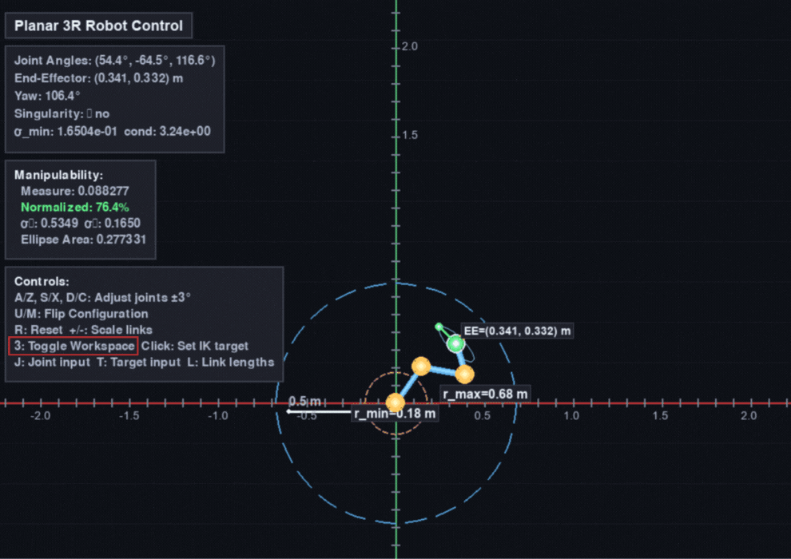
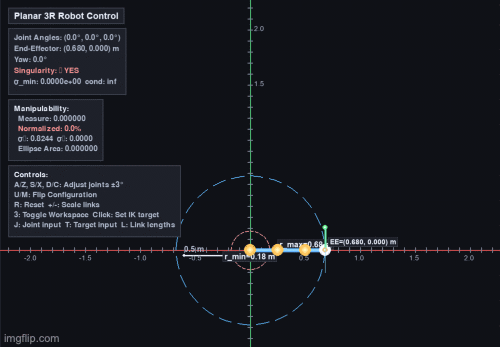

# 3-DOF Planar RRR Robot Kinematics Simulation

This project provides an interactive 2D simulation and visualization of a planar 3R (revolute-revolute-revolute) robot manipulator. The simulation includes forward kinematics, inverse kinematics using Damped Least Squares method, singularity detection, manipulability analysis, workspace visualization, and real-time configuration switching. All kinematics computations are implemented using pure NumPy, with Pygame providing the interactive user interface.

# Table of Contents

- [User Installation Guide](#user-installation-guide)
  - [Prerequisites](#prerequisites)
  - [Install Project Workspace](#install-project-workspace)
- [Methodology](#methodology)
  - [Forward Kinematics](#forward-kinematics)
  - [Jacobian Matrix](#jacobian-matrix)
  - [Singularity Detection](#singularity-detection)
  - [Inverse Kinematics - Damped Least Squares](#inverse-kinematics---damped-least-squares)
  - [Manipulability Analysis](#manipulability-analysis)
  - [Configuration Switching](#configuration-switching)
- [System Architecture](#system-architecture)
- [User Guide](#user-guide)
  - [How to Run the Simulation](#how-to-run-the-simulation)
  - [How to Use the Interface](#how-to-use-the-interface)
  - [Keyboard Controls](#keyboard-controls)
  - [Mouse Controls](#mouse-controls)
  - [Input Modes](#input-modes)
- [Features](#features)
- [Demos and Result](#demos-and-result)
- [Future Plan](#future-plan)

# User Installation Guide

## Prerequisites

Ensure you have the following dependencies installed:

**Python Version**

- `Python 3.8+`

**Python Libraries**

- `pygame >= 2.5.2`
- `numpy >= 1.26`

No compiled dependencies beyond Pygame; pure NumPy backend for all kinematics computations.

## Install Project Workspace

1. Clone or download this repository:

```bash
git clone <repository-url>
cd Kinematic
```

2. Create a virtual environment (recommended):

```bash
python -m venv .venv
```

3. Activate the virtual environment:

```bash
# On Windows (PowerShell)
.venv\Scripts\activate

# On macOS/Linux
source .venv/bin/activate
```

4. Install dependencies:

```bash
pip install -r requirements.txt
```

# Methodology

## Forward Kinematics

The forward kinematics for a planar 3R robot computes the end-effector position $(x, y)$ and orientation (yaw) from joint angles $(q_1, q_2, q_3)$.

The position is calculated as:

```math
x = l_1 \cos(q_1) + l_2 \cos(q_1 + q_2) + l_3 \cos(q_1 + q_2 + q_3)
```

```math
y = l_1 \sin(q_1) + l_2 \sin(q_1 + q_2) + l_3 \sin(q_1 + q_2 + q_3)
```

The end-effector yaw angle is:

```math
\theta_{yaw} = q_1 + q_2 + q_3
```

Where:

- $l_1, l_2, l_3$ are the link lengths (in meters)
- $q_1, q_2, q_3$ are the joint angles (in radians)

## Jacobian Matrix

The Jacobian matrix relates joint velocities to end-effector velocities. For a planar 3R robot with position-only control, we compute a 2×3 position Jacobian:

```math
J = \begin{bmatrix}
\frac{\partial x}{\partial q_1} & \frac{\partial x}{\partial q_2} & \frac{\partial x}{\partial q_3} \\
\frac{\partial y}{\partial q_1} & \frac{\partial y}{\partial q_2} & \frac{\partial y}{\partial q_3}
\end{bmatrix}
```

The partial derivatives are:

```math
\frac{\partial x}{\partial q_1} = -l_1 \sin(q_1) - l_2 \sin(q_1 + q_2) - l_3 \sin(q_1 + q_2 + q_3)
```

```math
\frac{\partial x}{\partial q_2} = -l_2 \sin(q_1 + q_2) - l_3 \sin(q_1 + q_2 + q_3)
```

```math
\frac{\partial x}{\partial q_3} = -l_3 \sin(q_1 + q_2 + q_3)
```

```math
\frac{\partial y}{\partial q_1} = l_1 \cos(q_1) + l_2 \cos(q_1 + q_2) + l_3 \cos(q_1 + q_2 + q_3)
```

```math
\frac{\partial y}{\partial q_2} = l_2 \cos(q_1 + q_2) + l_3 \cos(q_1 + q_2 + q_3)
```

```math
\frac{\partial y}{\partial q_3} = l_3 \cos(q_1 + q_2 + q_3)
```

## Singularity Detection

A singular configuration occurs when the robot loses one or more degrees of freedom in task space. For a planar 3R robot, singularity is detected using the singular values of the Jacobian matrix.

The robot is singular when:

```math
\sigma_{min} < \epsilon
```

or

```math
\text{cond}(J) = \frac{\sigma_{max}}{\sigma_{min}} > \text{threshold}
```

Where:

- $\sigma_{min}, \sigma_{max}$ are the minimum and maximum singular values of $J$
- $\text{cond}(J)$ is the condition number of the Jacobian
- $\epsilon = 10^{-3}$ (threshold for minimum singular value)
- Threshold for condition number: $10^5$

## Inverse Kinematics - Damped Least Squares

The inverse kinematics problem is solved using the Damped Least Squares (DLS) method, also known as the Levenberg-Marquardt method. This approach avoids singularities by adding a damping term.

The DLS update equation is:

```math
\Delta q = (J^T J + \lambda^2 I)^{-1} J^T e
```

Where:

- $J$ is the 2×3 position Jacobian matrix
- $e = (x_{target} - x_{current}, y_{target} - y_{current})^T$ is the position error
- $\lambda = 0.01$ is the damping coefficient
- $I$ is the 3×3 identity matrix
- $\Delta q$ is the joint angle update

The joint angles are updated iteratively:

```math
q_{new} = q_{current} + \Delta q
```

The iteration continues until the position error is below $10^{-4}$ m or a maximum of 300 iterations is reached.

## Manipulability Analysis

Manipulability measures how well the robot can move in different directions at its current configuration. The manipulability metric is computed from the singular values of the Jacobian:

```math
w = \sigma_1 \times \sigma_2
```

Where:

- $w$ is the manipulability measure
- $\sigma_1, \sigma_2$ are the singular values of the position Jacobian

The manipulability ellipse area is:

```math
A = w \times \pi
```

The normalized manipulability (0-100%) provides a scale-independent measure of the robot's dexterity at the current configuration.

## Configuration Switching

For a given end-effector position, a planar 3R robot typically has multiple inverse kinematics solutions corresponding to different configurations (e.g., elbow-up vs elbow-down). The system can switch between these configurations while maintaining the same end-effector position using the `ik_flip_configuration()` method, which searches for alternative solutions with different elbow orientations.

# System Architecture



The system consists of three main components:

1. **Robot Backend (`engine/robot_backend.py`)**

   - Implements the `Planar3RRobot` class with all kinematics computations
   - Forward kinematics (FK)
   - Jacobian computation
   - Inverse kinematics (IK) using Damped Least Squares
   - Singularity detection and metrics
   - Manipulability analysis via SVD
   - Configuration switching

2. **Workspace Sampler (`engine/workspace.py`)**

   - Samples the robot's workspace by sweeping through joint angle combinations
   - Generates visualization points for the reachable workspace

3. **Main Application (`src/main.py`)**
   - Pygame-based user interface
   - Real-time visualization and interaction
   - Motion controller for smooth joint movements
   - Text input system for precise value entry
   - Information panels (HUD) displaying robot state and metrics

# User Guide

## How to Run the Simulation

After installing dependencies, run the simulation:

```bash
python src/main.py
```

The application window will open with the robot visualization and control interface.

## How to Use the Interface



The interface consists of:

1. **Main Visualization Area**: Shows the robot, coordinate axes, workspace boundaries, and manipulability ellipse
2. **Information Panels (HUD)**: Display robot state, joint angles, end-effector position, singularity status, and manipulability metrics
3. **Control Panels**: Show available keyboard shortcuts and controls

## Keyboard Controls

### Joint Control

- **A / Z**: Increase/decrease joint 1 ($q_1$) by ±3°
- **S / X**: Increase/decrease joint 2 ($q_2$) by ±3°
- **D / C**: Increase/decrease joint 3 ($q_3$) by ±3°
- **R**: Reset all joint angles to zero

### Configuration Control



- **U**: Switch to elbow-up configuration (พับแขนขึ้น)
- **M**: Switch to elbow-down configuration (พับแขนลง)
  - Both maintain the current end-effector position while changing the robot's configuration

### Workspace and Visualization



- **3**: Toggle workspace visualization (show/hide reachable workspace points)
- **+ / -**: Scale robot link lengths (increase/decrease by 5%)

### Input Modes

- **J**: Enter joint angles manually (in degrees, comma-separated)
- **T**: Enter target position for IK (in meters, x,y format)
- **L**: Enter link lengths (in meters, L1,L2,L3 format)

### System

- **ESC / Q**: Quit the application

## Mouse Controls

- **Left Click**: Set IK target position at the clicked location
  - The robot will smoothly move to reach the target position
  - Green circle indicates reachable target
  - Red cross indicates unreachable target

## Input Modes

When you press **J**, **T**, or **L**, a text input dialog appears at the bottom of the screen:

**Joint Input (J)**



- Enter three joint angles in degrees
- Format: `q1,q2,q3` (e.g., `30,45,-60`)
- Press **Enter** to apply, **Esc** to cancel

**Target Input (T)**


- Enter target position in meters
- Format: `x,y` (e.g., `0.3,0.2`)
- Press **Enter** to apply, **Esc** to cancel
- The robot will solve IK and move to the target

**Link Lengths Input (L)**


- Enter link lengths in meters
- Format: `L1,L2,L3` (e.g., `0.25,0.25,0.18`)
- Press **Enter** to apply, **Esc** to cancel
- All values must be positive

# Features

- **Forward Kinematics**: Real-time computation of end-effector position and orientation
- **Inverse Kinematics**: Damped Least Squares solver for position control
- **Singularity Detection**: Automatic detection and warning of singular configurations
- **Manipulability Analysis**: Real-time manipulability metrics and visualization
- **Workspace Visualization**: Visual representation of reachable workspace
- **Configuration Switching**: Switch between elbow-up and elbow-down configurations
- **Smooth Motion**: Interpolated joint movements with smoothstep easing
- **Interactive Controls**: Keyboard and mouse-based control
- **Real-time Metrics**: Live display of joint angles, position, singularity status, and manipulability
- **Modern UI**: Clean, dark-themed interface with organized information panels

# Demos and Result

<video src="https://github.com/Thyme2303/Kinematic/blob/main/assets/manipulability_demo.mp4
" controls width="800"></video>

The simulation provides real-time visualization of:

1. **Robot State**: Current joint angles, end-effector position, and orientation
2. **Singularity Status**: Visual and numeric indicators of singular configurations
3. **Manipulability Metrics**:
   - Manipulability measure ($w = \sigma_1 \times \sigma_2$)
   - Normalized manipulability (0-100%)
   - Singular values ($\sigma_1, \sigma_2$)
   - Manipulability ellipse area
4. **Workspace Boundaries**: Inner and outer reach limits
5. **Manipulability Ellipse**: Visual representation at the end-effector showing directional dexterity

The interface updates at 60 FPS for smooth visualization and responsive controls.

## Usage Examples

**Forward Kinematics Control**

- Adjust joint angles using keyboard (A/Z, S/X, D/C) to move the end-effector
- Observe real-time changes in position and manipulability

**Inverse Kinematics Control**

- Click anywhere in the workspace to make the robot move to that position
- The system automatically calculates joint angles and moves smoothly

**Configuration Switching**

- Use U/M keys to switch between elbow-up and elbow-down while keeping the end-effector at the same position
- Compare manipulability values between different configurations

# Future Plan

- **Trajectory Planning**: Add smooth trajectory generation between waypoints
- **Collision Detection**: Implement workspace obstacles and collision avoidance
- **Velocity Control**: Add velocity-based IK control in addition to position control
- **Recording/Playback**: Save and replay robot motion sequences
- **Export Functionality**: Export workspace data, trajectories, or robot configurations
- **Multiple Robot Support**: Simulate multiple robots in the same workspace
- **Force/Torque Visualization**: Display joint torques and end-effector forces
- **Advanced IK Methods**: Implement other IK solvers (e.g., analytical IK, gradient descent variants)
- **Performance Optimization**: Optimize workspace sampling for larger datasets
- **Documentation**: Add detailed API documentation and usage examples

# Kinematic
